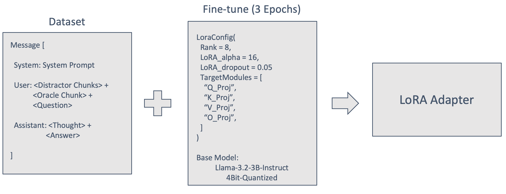

# LearnRAG

A lightweight retrieval-augmented learning assistant that pairs classical (BM25) and neural (ChromaDB) retrieval with compact LLMs, LoRA fine-tuning and chain-of-thought (CoT) reasoning.

---

## Colab Notebook

Interactive demo: **[Open in Colab](https://drive.google.com/file/d/1Z_a-ceWqx19_B3peBO2rgw292oHUMSMA/view?usp=sharing)**

---

## 🛣️ Roadmap

| Component                  | Status     |
|---------------------------|------------|
| ✅ Basic Colab Workflow   | **Done**   |
| ✅ Finetuning Scripts     | **Done** *(pending upload)* |
| 🔄 Vector DB Integration  | **Planned** |
| 🔄 Evaluation Framework   | **Planned** |

---

## Methodology

This project builds a chatbot that helps students explore topics such as machine learning, deep learning and natural-language processing.  
Using a Retrieval-Augmented Generation (RAG) framework, the system retrieves external context instead of fine-tuning the base model directly. Three pipelines are implemented:

### Pipeline Architectures

### Dataset Construction Workflow

### Prompt Templates

### Language Model Fine-tuning
Fine-tuning follows the **RAFT** recipe: for each knowledge chunk, three GPT-generated queries and CoT answers are created; three distractor chunks are injected to teach the model to ignore noise.  
LoRA rank 8, α = 16, 10 epochs; checkpoint from epoch 3 is used once loss ≈ 0.4.  
Core libraries: Hugging Face *Transformers*, *PEFT*, *TRL*.

---

## References

- Zhang T. *et al.* “RAFT: Adapting Language Model to Domain-Specific RAG”, 2024.  
- **Gorilla** dataset & tools – <https://github.com/ShishirPatil/gorilla>  
- Hu E. *et al.* “LoRA: Low-Rank Adaptation of Large Language Models”, 2021.
